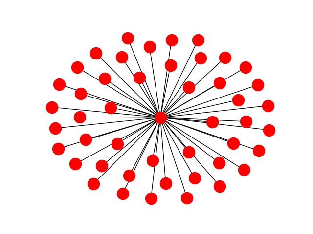

# Determining if Bitcion is becoming a widly used currency.

With the past couple years there have been claims that Bitcion will be the currency to replace modern forms of currency but what would this mean and how is the current transactional history evidence of this.  To keep bias from lerking into my results, except where they tie in, I am going to refrain from talking about other parts of Bitcoin.  

## Brief Introduction to Bitcoin

Before diving into the nitty gritty of my findings, I want to give an overview of how Bitcoin works and the methodology behind it.  Bitcoin is a completely decentralized form of currency with money exchanging hands through the blockchain.  The blockchain is essentially a leger of every single transaction that has every taken place over the Bitcoin network. For this reason, Bitcoin gives the appearance of anononymity while ensuring no single entity controls the balance of the flow of money.  It is secure and distributed becasue of the blockchain but is also a reason why adoption might be low.  Each transaction that orrurs has to go throught a verification process called mining.  Once a transaction has been mined/verified it is added to the blockchain.  When it comes time for results I will go into some depth with reference to the statistics of Bitcoin transaction confirmation so this will be elaborated in the coming sections.  

## Motivation For Analyzing Bitcoin

With a general grasp of how Bitcoin works, I wanted to find out if the Bitcoin network could offer some insight into how the current state of the currency might shed some light on its future.  There is no doubt it is a market disrupter but which market is is disrupting.  Could all the hype surrounding Bitcoin be genuine and it should be taken seriously as a currency or could it be a fallacy that fades away once investor trading dies down?  These questions will only have definitive answers in due time but with Bitcoin being the oldest main stream crypto currency it is a perfect candidate to examine purchasing patterns over the years.  

## Gathering Data

Being an open currency where the blockchain contains every transaction ever made with the currency is publically available, you could imagine the volume of information the blockchain must contain.  If you were to download the entier Bitcoin blockchain, you would need more than 150 Gb of storage space.  My computer has 32 Gb of RAM and unless I want to use paging to virtually increase this to the necessary 150 Gb, there was going to have to be a way to reduce this.  Sampling was inevitebly used. 

A quick aside about a Bitcoin transaction.  Unlike sending $30 from my bank to Whole Foods which has one sender and one receiver, a Bitcion transaction can have multiple senders and multiple receivers.  Knowing this, I wanted to make sure that if a transaction only had one sender or one receiver, the transactions had a higher chance of getting added to the sampled network.  So when iterating through the entire blockchain and all its transactions, the chance a sender being picked was proportional to 1 / (2 * #Senders).  Similarily the chance a sender would be picked was 1 / (2 * #Receivers).  So if there was 1 sender and 10 receivers.  The receiver would have a 50% chance of being selected and any one of the receivers would have a %5 chance of being selected.  

This sampling technique does not have an effect of the trends that would emerge from the network.  For instance, a transaction from 1 sender to 1 receiver would not be disproportitely represented in the network since these are on the transaction level not the overall degree level.  I wish I could have included more nodes in the network but unfortunately even storing only the sender and receiver as integers was still on the order of Gb's for the sample from 2017.  My sampling technique was effective in reducing the dataset to a managable level, around 500 Mb for 2017.  I know what you might be thining, "You have 32 Gb of RAM why can't you handle a larger dataset".  While it would make sense that with this level of data I could import a much larger subset of the Bitcoin netowrk, when loading the edge list into NetworkX, that 500Mb edge list turns into a 29 Gb NetworkX object and taking into account other OS processes, all my RAM gets taken and paging starts.  With all this being said sampling was successful and I got as much data as I could given restrictions. 

Another way I broke the Bitcion blockchain into smaller pieces was create an edge list for each year.  This not only made the size of the dataset even more managable but it also gave me a time domain that would be very useful when tryign to evaluate whether or not the currency was growing.   Each year is more extensive than the last but luckily we are early into 2018 so memory usage shoudle managable. 

## Analyzing the Bitcoin Network
After sampling, different analysis could be done on the network to bring to light any trends that could shed light on the adoption of Bitcoin.  Obvious metrics such as average degree, number of nodes, and number of edges were calculated.  This offered some useful information but it didn't help when trying to identify usage information.  So I also introduced a calculation to identify all nodes that were a part of a 2 node network.  With my method of sampling it left the majority of nodes in a configuration where node A has only one neighbor B and B's only neighbor is also A.  I suspected this would be the case so I wrote a method to find all sub netowrks which only has 2 nodes.  

After some reflection the values I was getting out of these calculations, I realized that the Bitcoin exchanges were skewing the results.  To convert a fiat currency into Bitcion, the transfer usually goes through a exchange so if thousands of people were trading their USDs into Bitcoin, certain nodes would have a tremendous number of edges.  There is also an edge case of user that I wanted to exclude from my calculations and that is Bitcoin traders.  These people have no intention of using Bitcoin as a currency but more as a vehicle to make a capital gain.  The method I went about removing these people was to cull the network of all nodes whose degree was greater than 4 or 5 standard deviations from the mean.  As I tried different standard deviations I wanted to make sure that the vast majority of money-transfering transactions were removed while keeping as many suspected purchases intact.  A standard deviation of 4 was used for 2012-2015 networks as the average removed node had around a degree of 150-200 where 5 was used for 2016-present.  Since 2016 the volume of trading for capital gains skyrocketed and as such I needed a higher threshhold to make sure the nodes with a degree of 500+ were not tainting my results.  

## Preliminary Results
All the graph metrics highlighted in the previous sections are now run on both the graph with all nodes intact as well as the graph in which the nodes with high degrees were removed. I have included the results below but I am still runnning qualitative metrics on the data I have gathered.  

This image is what the majority of the network looks like.  Many 2 node relationships.

This is what a hub in the network looks like.  It is impossible to tell if this node is a single person who has a lot of trading activity or an exchange but this node has fewer than 100 edges so it is likely it is a single person.

This table illustrates the similarity of sender/receiver from one year to any other year. 

|      | 2012  | 2013   | 2014   | 2015   | 2016   | 2017   | 2018   | 
| ---- | ----- | ------ | ------ | ------ | ------ | ------ | ------ |
| 2012 | -1    | 12412  | 4024   | 1524   | 983    | 1016   | 200    | 
| 2013 | 12412 | -1     | 105717 | 24277  | 12637  | 11408  | 1998   |
| 2014 | 4024  | 105717 | -1     | 179016 | 63101  | 38839  | 6828   |
| 2015 | 1524  | 24277  | 179016 | -1     | 376882 | 100899 | 17158  |
| 2016 | 983   | 12637  | 63101  | 376882 | -1     | 474432 | 43474  |
| 2017 | 1016  | 11408  | 38839  | 100899 | 474432 | -1     | 341469 |
| 2018 | 200   | 1998   | 6828   | 17158  | 43474  | 341469 | -1     |

The rest of the data is still raw but it is being used to calculate the level by which teh Bitcoin network is maturing.  
